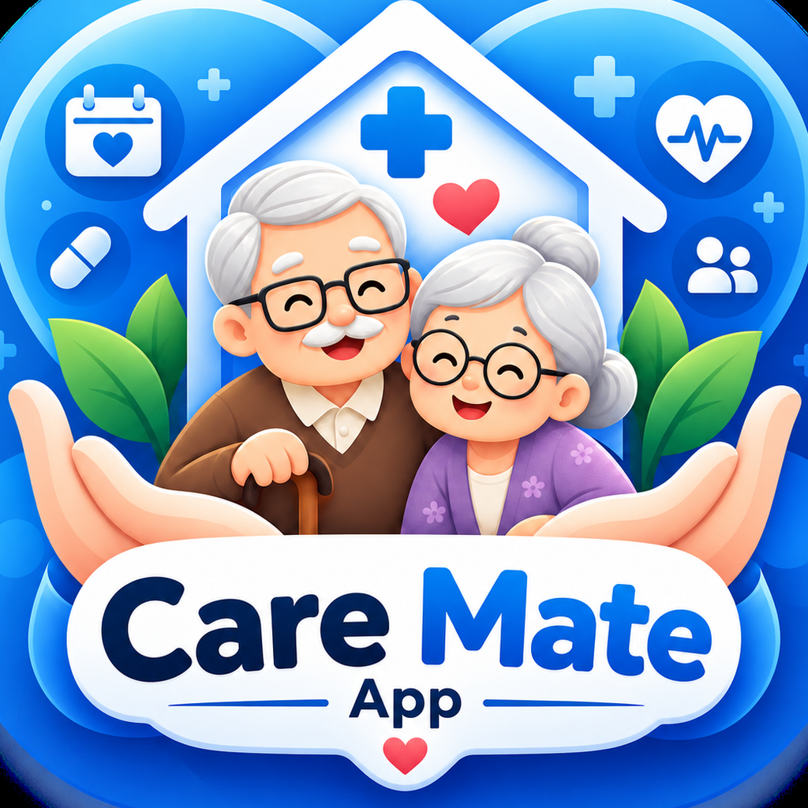

<div align="center">



# CareMate 2.0

**ดูแลใกล้ชิด แม้อยู่ไกล** — แอปดูแลผู้สูงอายุสำหรับลูกหลาน + กล่องเตือนทานยา IoT

[](./LICENSE)


</div>

---

## CareMate คืออะไร

ลูกหลานที่อยู่ไกลมักกังวลว่าพ่อแม่/ปู่ย่าตายายจะ **ลืมทานยา** หรือมีค่าสุขภาพผิดปกติแล้วไม่รู้ตัว
CareMate แก้ปัญหานี้ด้วย **แอปมือถือสำหรับผู้ดูแล** ทำงานคู่กับ **กล่องเตือนทานยา IoT (KidBright32 iP / ESP32)** ที่วางไว้ที่บ้านผู้สูงอายุ

- 📦 **กล่อง → แอป** : ถึงเวลายา กล่องส่งเสียงเตือน ผู้สูงอายุกดปุ่ม "ทานแล้ว" → เด้งขึ้นแอปลูกหลาน **ทันที (realtime)**
- 📱 **แอป → กล่อง** : ลูกหลานตั้งยา/สั่งทดสอบเสียง/รีเซ็ต WiFi จากแอป → กล่องรับคำสั่งเอง
- 🔌 กล่องทำงาน **อิสระ** ไม่ต้องพึ่งมือถือผู้สูงอายุ (สื่อสารกับคลาวด์ผ่าน WiFi โดยตรง)

> โปรเจกต์นี้เป็นทั้งซอฟต์แวร์ (แอป + backend) และฮาร์ดแวร์ (เฟิร์มแวร์กล่อง) — เปิดเป็น open source ให้นำไปพัฒนาต่อได้

---

## ฟีเจอร์หลัก

**ยาและการเตือน**
- ตั้งรายการยา เวลาทาน แจ้งเตือนอัตโนมัติ
- บันทึกสถานะ ทานแล้ว/เลื่อน/พลาด (จากกล่องหรือจากแอป)
- แจ้งเตือน push เมื่อ **พลาดยาเกินกำหนด** (ตรวจด้วย cron ทุกช่วงเวลา)

**สุขภาพ**
- บันทึกความดัน / น้ำตาล / ชีพจร
- **กราฟแนวโน้มเฉลี่ยรายวัน** สลับดู 7 / 30 วัน
- ประเมินค่าตามเกณฑ์มาตรฐาน (AHA) + คำแนะนำอัตโนมัติ
- ตัวกรอง "ทั้งหมด / เฉพาะผิดปกติ"

**กล่อง IoT (หลายกล่อง/หลายผู้ป่วยได้)**
- ตั้งค่า WiFi ผ่านมือถือ (captive portal) — ผู้ใช้ปลายทางไม่ต้องแตะโค้ด
- แสดงสถานะกล่อง ออนไลน์ / ออฟไลน์ / กำลังตั้งค่า
- เลือกเสียงเตือน 3 แบบ, ปุ่มทดสอบเสียง, รีเซ็ต WiFi, ถอดกล่อง — จากแอป

**อื่น ๆ**
- นัดหมายแพทย์ (ตัวกรอง กำลังจะถึง/ผ่านมาแล้ว)
- ศูนย์แจ้งเตือน (ป็อปอัพ + ตัวกรอง ทั้งหมด/ยังไม่อ่าน)
- เข้าสู่ระบบด้วยอีเมล หรือ **Google** ([คู่มือตั้งค่า](./GOOGLE_LOGIN_SETUP.md))
- Onboarding ครั้งแรก + ขอสิทธิ์ + **ยินยอม PDPA**
- อากาศตามพิกัดในหน้าแรก, ธีม Light/Dark, ฟอนต์ **LINE Seed Sans TH**, ไอคอน **Lucide**

**ความเป็นส่วนตัว & ความปลอดภัย**
- **RLS (Row Level Security)** แยกข้อมูลรายผู้ดูแล — เห็นเฉพาะผู้ป่วยของตัวเอง
- รองรับ **PDPA** : ขอความยินยอม + ลบบัญชีถาวรได้ในแอป
- กล่องยืนยันตัวด้วย device key ผ่าน Edge Function (service role ไม่หลุดถึง client)

---

## สถาปัตยกรรม

```
┌─────────────┐        WiFi/HTTPS         ┌──────────────────────┐
│ กล่อง IoT   │  ───────────────────────▶ │      Supabase        │
│ KidBright32 │      device-poll /        │  Postgres + RLS      │
│  (ESP32)    │ ◀───────────────────────  │  Edge Functions      │
└─────────────┘   due, sound, commands    │  Realtime + pg_cron  │
                                          └──────────┬───────────┘
                                       Realtime / REST │ (anon key + RLS)
                                                       ▼
                                          ┌──────────────────────┐
                                          │  แอปผู้ดูแล (Expo)    │
                                          │  React Native + RN    │
                                          └──────────────────────┘
```

- **กล่อง** คุยกับ Edge Functions (`device-poll`, `device-confirm`) ด้วย service role ฝั่ง server
- **แอป** คุยกับ Postgres ตรง ๆ ด้วย anon key โดยมี RLS คุ้มกัน
- **cron** (`check-missed-doses`) ตรวจยาที่พลาด แล้วสร้าง alert + ส่ง push

---

## Tech Stack

| ส่วน | เทคโนโลยี |
|---|---|
| แอป | Expo SDK 54, React Native 0.81, expo-router, TypeScript |
| State/Data | @tanstack/react-query v5, Supabase Realtime |
| UI | Design tokens เอง (light/dark), react-native-svg, Lucide, LINE Seed Sans TH |
| Backend | Supabase (Postgres, Auth, RLS, Edge Functions/Deno, Realtime, pg_cron) |
| Push | expo-notifications + Expo Push |
| ฮาร์ดแวร์ | KidBright32 iP (ESP32), MicroPython |

---

## โครงสร้างโปรเจกต์

```
app/            # หน้าจอ (expo-router, file-based)
  (auth)/       # เข้าสู่ระบบ / สมัคร (+ Google login)
  (tabs)/       # หน้าหลัก · ยา · สุขภาพ · อุปกรณ์ · เพิ่มเติม
  ...           # onboarding, alerts, appointments, add-* ฯลฯ
components/     # UI components + charts/TrendChart
lib/            # data hooks (supabase, auth, medications, vitals, devices, push, realtime ...)
theme/          # design tokens + ThemeProvider + fonts
supabase/       # schema.sql, rls_policies.sql, functions/, PUSH_SETUP.md
firmware/       # kidbright/ — main.py (MicroPython) + คู่มือ flash/WiFi
```

---

## เริ่มใช้งาน (Development)

**ต้องมี:** Node.js 18+, บัญชี [Supabase](https://supabase.com) (ฟรี), Expo Go หรือ Android Studio

```bash
# 1) ติดตั้ง
git clone https://github.com/devpanitan/caremate.git
cd caremate
npm install

# 2) ตั้งค่า environment
cp .env.example .env
# แก้ .env ใส่ค่าจาก Supabase → Project Settings → API
#   EXPO_PUBLIC_SUPABASE_URL, EXPO_PUBLIC_SUPABASE_ANON_KEY

# 3) รัน
npx expo start        # กด a เปิด Android, i เปิด iOS, หรือสแกน QR ด้วย Expo Go
```

### ตั้งค่า Supabase (backend)

```bash
# ใน Supabase SQL Editor รันตามลำดับ:
#   1. supabase/schema.sql        → สร้างตารางทั้งหมด
#   2. supabase/rls_policies.sql  → เปิด RLS + policies

# deploy Edge Functions
npx supabase login
npx supabase functions deploy device-poll     --no-verify-jwt
npx supabase functions deploy device-confirm  --no-verify-jwt
npx supabase functions deploy check-missed-doses --no-verify-jwt
npx supabase functions deploy delete-account   # (ต้อง verify JWT)
```

- ตั้ง cron ให้ `check-missed-doses` + push notifications: ดู [`supabase/PUSH_SETUP.md`](./supabase/PUSH_SETUP.md)
- เข้าสู่ระบบด้วย Google (ไม่บังคับ): ดู [`GOOGLE_LOGIN_SETUP.md`](./GOOGLE_LOGIN_SETUP.md)

### กล่อง IoT (ไม่บังคับ — แอปทำงานได้โดยไม่มีกล่อง)

flash เฟิร์มแวร์ `firmware/kidbright/main.py` ลง KidBright32 iP / ESP32 ด้วย Thonny
แล้วตั้งค่า WiFi ผ่านมือถือ — ทำตาม [`firmware/kidbright/WIFI_SETUP_GUIDE.md`](./firmware/kidbright/WIFI_SETUP_GUIDE.md)

---

## Build เป็น APK

```bash
eas build -p android --profile preview   # ได้ไฟล์ .apk ติดตั้งได้เลย
```

> Google login และ push notifications ใช้ได้เฉพาะบน build จริง (APK/dev build) ไม่ทำงานใน Expo Go

---

## Roadmap

- [ ] แผนที่ปักหมุดตำแหน่งกล่องแต่ละจุด
- [ ] แยกกราฟน้ำตาลก่อน/หลังอาหาร
- [ ] รายงานสุขภาพส่งออก PDF ให้แพทย์
- [ ] รองรับหลายภาษา

---

## License

เผยแพร่ภายใต้สัญญาอนุญาต [MIT](./LICENSE) — นำไปใช้ แก้ไข และแจกจ่ายต่อได้อย่างอิสระ

<div align="center">
สร้างด้วย ❤️ เพื่อการดูแลผู้สูงอายุในครอบครัวไทย
</div>
